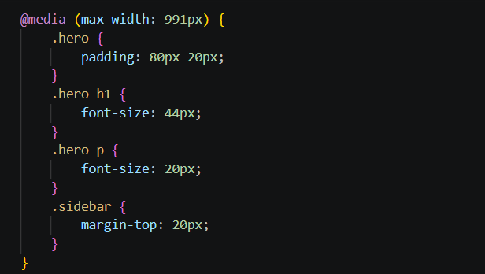
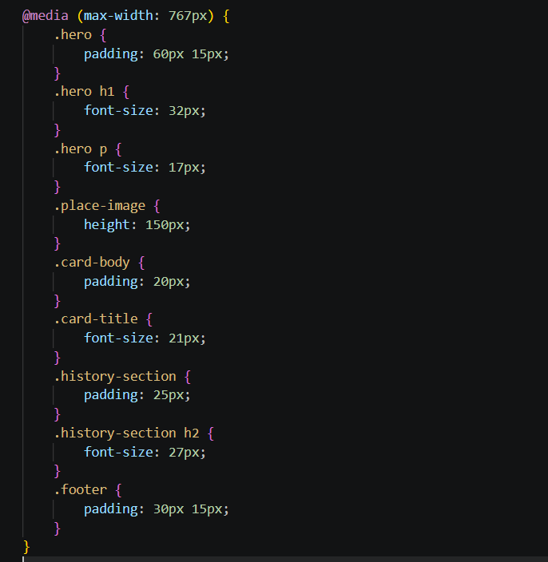
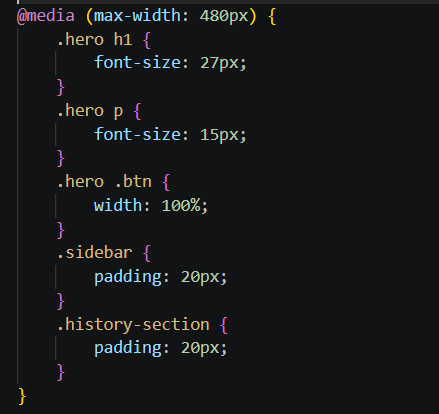
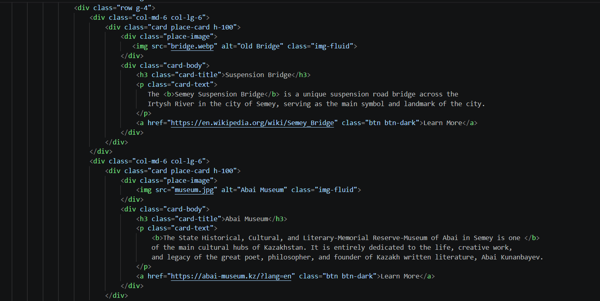
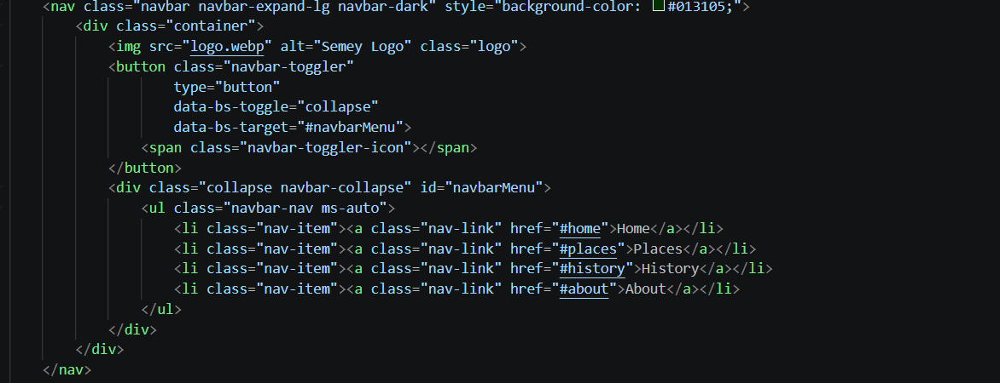
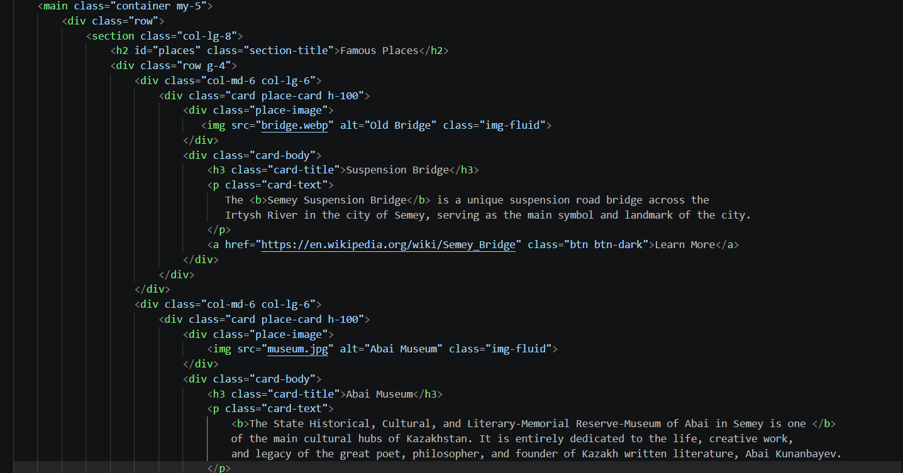
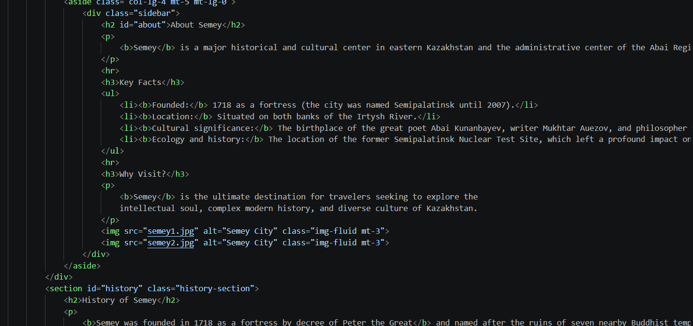
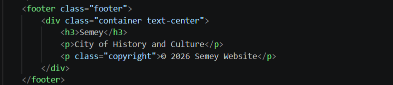
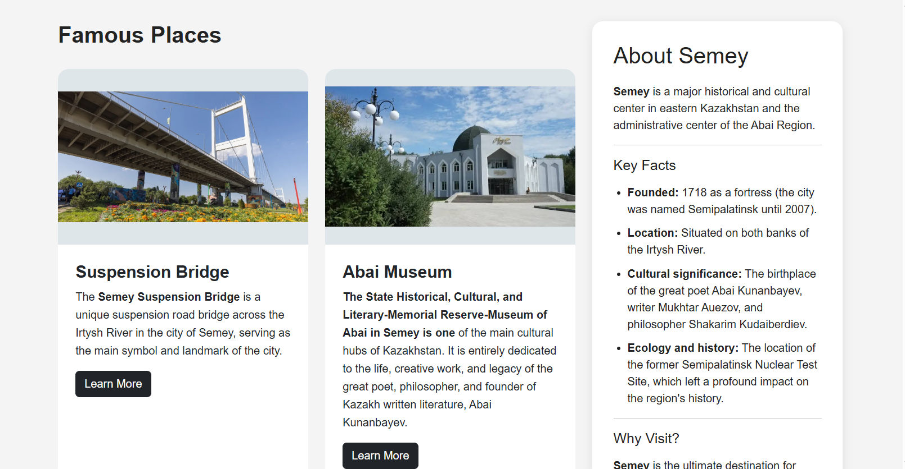

Amina Toleugazinova IT-2513
Assignment 3

Part 1
Task 0
Created a simple webpage with headings and paragraphs.   
Used CSS media queries to adjust font sizes for different devices, ensuring typography is smaller on mobile, medium on tablet, and larger on desktop screens.  
Task 1
Designed a layout featuring three boxes in a row.
Configured the layout using only CSS media queries so that all three boxes display side by side on desktop, two boxes appear in a row on tablet, and the boxes stack vertically on mobile.

Part 2
Task 2
Built a responsive layout leveraging Bootstrap’s 12-column grid.
Configured three columns to each take 4 columns (3 equal parts) on desktop, transition to two columns on the first row and one on the second row for tablet, and stack vertically on mobile screens.

Task 3
Implemented a responsive navigation bar using Bootstrap components.
Included a logo on the left, navigation links on the right, and configured the menu to collapse into a hamburger toggle on smaller screens.

Part 3
Task 4
Created a comprehensive responsive page utilizing both custom Media Queries and the Bootstrap Grid.   
Implemented a header containing a Bootstrap navbar.   
Divided the main layout into two distinct parts: a left side showcasing items using the Bootstrap grid, and a right-side sidebar.   
Added a unified footer across the bottom of the page.   
Applied custom CSS media queries to independently adjust font sizes, spacing, and element visibility for mobile, tablet, and desktop breakpoints.  

